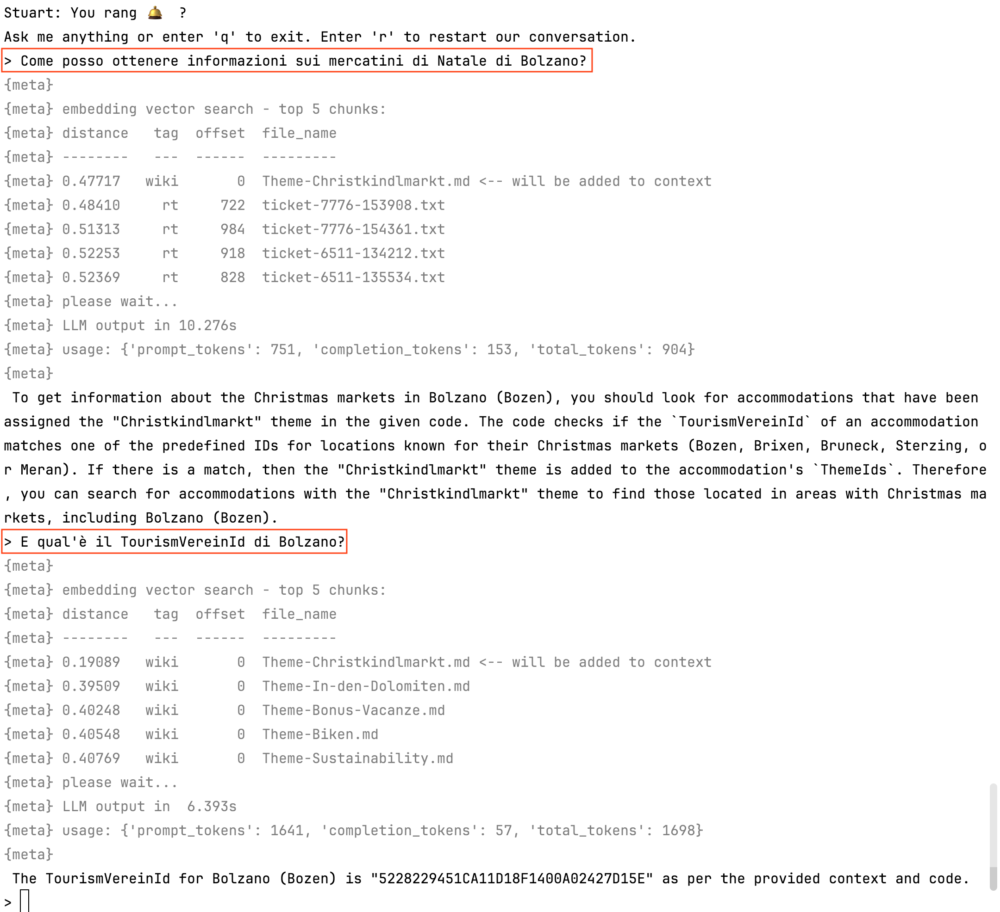

# Stuart 🛎

(**S**uper **T**alkative **U**nderstanding **A**rtificial **R**esponse **T**echnology)

<!-- TOC -->
* [Stuart 🛎](#stuart-)
  * [Background](#background)
  * [Installation](#installation)
    * [Stuart](#stuart)
    * [PostgreSQL](#postgresql)
  * [Preparing the Data](#preparing-the-data)
    * [Scraping the Documents](#scraping-the-documents)
    * [RAGging  the Documents](#ragging--the-documents)
  * [Running the Chatbot](#running-the-chatbot)
  * [A Note about the Models used](#a-note-about-the-models-used)
  * [A Note about Performance](#a-note-about-performance)
<!-- TOC -->

```text
Stuart: You rang 🛎️ ?
Ask me anything or enter 'q' to exit. Enter 'r' to restart our conversation.
> What is Stuart?
 Stuart is a chatbot that assists the customer care team of Open Data Hub in
 solving tickets. It uses the Open Data Hub Wiki, past tickets history, and the
 readme files of all repositories as inputs to help answer customer inquiries.
> 
```

**Changelog of this document**

2024-03-25 first release - Chris Mair <chris@1006.org>

## Background

Stuart uses RAG (_retrieval-augmented generation_). RAG improves the quality of responses by
combining the capabilities of two main components: a retrieval system and a generative model.

The retrieval system searches a database of documents, specifically the Open Data Hub wiki,
the past tickets history and the readme files of all related repositories to find information
that is relevant to the user's question. This step is crucial as it allows the generative model
to access knowledge  that is not contained in its pre-trained parameters.

The generative model receives a prompt that is constructed from the retrieved 
information and the user's input.  It then generates a coherent, natural text based on that prompt.

Stuart is a proof-of-concept system built with a few guiding principles:

- the system should run locally (no proprietary APIs)
- it should only rely on Free models
- it should be able to run on modest hardware (no expensive datacenter GPUs)

Currently, there are a few well known Python packages to build RAG
systems such as [LlamaIndex](https://docs.llamaindex.ai/en/stable/) and
[LangChain](https://www.langchain.com/). These packages are basically glue code
that abstracts away details about the underlying models and software components.
An early prototype of Stuart used LlamaIndex. However, these systems appear to
be in very quick evolution, are somewhat black-boxy and the integration between
their components and the documentation is sometimes lagging their quick progress.

To better understand the underlying technology and to keep things stable and simple,
we opted to not rely on any of these frameworks and rather implement a few functions,
such as text chunking and database access from scratch. It turned out that the
resulting code was not much longer, but easier to understand with way less 
dependencies.

## Installation

Stuart is best run on a *nix OS.

The installation has been tested on macOS 13 with the command line developer
tools and on Linux (Debian 12) with the developer tools (packages 
`build-essential`, `git` and `python3-venv` must be installed). The developer
tools are required, as one Python library does not (yet) offer binary releases
and needs to be compiled.

You need **about 15 GiB of free space** for the model files and Python libraries.
Additionally, some space for the PostgreSQL database (for the installation at
NOI that's less than 200 MiB).

### Stuart

Stuart needs a Python 3 environment with venv. The third-party Python libraries
are listed in `requirements.txt`:

```text
llama-cpp-python==0.2.56
psycopg2-binary==2.9.9
sentence-transformers==2.6.0
```

That being said, installation is as simple as running the following commands as a normal
user:

```text
cd ~
git clone https://github.com/noi-techpark/stuart-chatbot
cd stuart-chatbot
python3 -m venv .venv
source .venv/bin/activate
pip install -r requirements.txt 
```

That's it!

Almost. We also need to install the LLM itself (more below). Download
the model file into the home directory (4.8 GiB):

```text
cd ~
curl -LO https://huggingface.co/TheBloke/Mistral-7B-Instruct-v0.2-GGUF/resolve/main/mistral-7b-instruct-v0.2.Q5_K_M.gguf
```

### PostgreSQL

Stuart needs a [PostgreSQL](https://www.postgresql.org/) database server with
the [pgvector](https://github.com/pgvector/pgvector) extension.

This can be basically any installation, local or managed. 

To install PostgreSQL locally, just follow the steps listed on the
[official download page](https://www.postgresql.org/download/). Once the
server is up, define a role and a database and activate pgvector:

```text
su - postgres
psql

postgres=# create role rag login password '********';
 CREATE ROLE
postgres=# create database ragdb owner rag;
 CREATE DATABASE
postgres=# \c ragdb
 You are now connected to database "ragdb" as user "postgres".
ragdb=# create extension vector;
 CREATE EXTENSION
postgres=# \q
```

Once the database is up, load the table definition (here I assume PostgreSQL is running on 127.0.0.1):

```text
cd ~/stuart-chatbot/
psql -h 127.0.0.1 -U rag ragdb < rag/schema.sql
```

and edit the file with the credentials:

```text
cd ~/stuart-chatbot/
vim rag/secrets_pg.json
```

Ready!

## Preparing the Data

### Scraping the Documents

Before the chatbot can be used for the first time, we need to scrape the documents:

- the readme markdown files from the relevant NOI Techpark repositories,
- the wiki markdown files from the ODH-Docs wiki,
- the tickets from the ODH Request Tracker installation.

For each category, there is a custom scraper in `scrapers/`.

Two scrapers are specially crafted for Stuart:

`scrape_readme.sh` scrapes the readme markdown files from the NOI Techpark repositories 
on GitHub that are relevant to the Open Data Hub. The links are read from a hand-crafted 
file (`scrape_readme_urls.txt`).

`scrape_wiki.sh` scrapes the wiki markdown files from the [ODH-Docs wiki](https://github.com/noi-techpark/odh-docs/wiki).

Additionally, there is a more generic scraper:
`scrape_rt.py` scrapes tickets from an installation of Best Practice' Request Tracker.
Or more precisely: it scrapes transactions of type 'Ticket created', 'Correspondence added'
or 'Comments added'. Remember to set up the location and credentials of the
Request Tracker installation in 'scrape_rt.json'! 

The documents are stored in the `~/stuart-chatbot/data_*` directories.

Currently, scraping the readmes and the wiki just takes a few seconds, but 
**scraping the tickets takes a few hours**. Luckily `scrape_rt.py` works
incrementally, but it still needs about 20 minutes to check each ticket for
new transactions.

> The easiest way to run all these scripts is to set up a cronjob that runs
> `cron/cron-scrape.sh` that will take care of everything.

### RAGging  the Documents

Before the chatbot can be used for the first time, we also need to "RAG" the documents.
RAGging means:

- read all the files from the `~/stuart-chatbot/data_*` directories

- chunk them into overlapping chunks of roughly equal size

- call a sentence embedding model (see [Wikipedia](https://en.wikipedia.org/wiki/Sentence_embedding))
to encode meaningful semantic information from each chunk into a point in a high-dimensional vector space

- store the file name, chunk and vector into PostgreSQL

That the job for `rag/load.py`.

When it runs for the first time, it will automatically download the sentence
embedding model (2.1 GiB) and put it into ~/.cache.

`rag/load.py` runs the model using the `sentence-transformers` library that
is based on PyTorch. The run time very much depends on the capabilities of
your hardware. On a system with a single CPU core this also might 
**take a few hours**. Luckily also `load.py` works incrementally, so if there
are no new documents, that are not yet loaded into PostgreSQL, it will exit
after a few seconds.

Note that `load.py` never deletes or updates documents from the database,
it just adds new ones. For ticket transactions this is fine. However,
wiki pages and readme change, so it is a good idea to delete these
from time to time, so they can be RAGged again. This can be done in Postgres
with `delete from ragdata where tag in ('readme', 'wiki');`.

> Again, there is a handy script that can be called from **crontab**: `cron/cron-load.sh`.

## Running the Chatbot

Currently, the chatbot is available as an interactive command line interface only.

Run it with these commands:

```text
cd ~/stuart-chatbot/
source .venv/bin/activate
cd rag/
python query.py
```

This will get you into an easy to use endless loop with the chatbot. Here is a sample
session!

---



---

Let's break down the components.

1. The user asks "Come posso ottenere informazioni sui mercatini di Natale di Bolzano?".

2. This piece of text is embedded and transformed into a vector. A query is run to find
   the closest vector stored in PostgreSQL and the top-5 matches are shown (lines starting 
   with `{meta}` are debug output). The best match is actually the right document: it's
   a wiki page talking about the Christmas markets ([here](https://github.com/noi-techpark/odh-docs/wiki/Theme-Christkindlmarkt)).

> Pause a moment to think about how powerful semantic search is! We use a multi-language
> embedding model, so the question is close to the wiki document because both refer to
> the _meaning_ "Christmas markets" regardless the fact that the _text_ is completely
> different. It's not even the same language (!).

3. The code proceeds to build a prompt using the original question and the chunk from
   the wiki document and inputs into the LLM.

4. The LLM answers with a (presumably) correct text.

5. The user asks a follow up question "E qual'è il TourismVereinId di Bolzano?"

6. Now the LLMs answer plus the new question is again embedded and searched for (leading
   to the same document found as best match).

7. A new prompt is built using the follow up question and the same chunk and input again to the LLM.

8. The LLMs answers with the information. "5228229451CA11D18F1400A02427D15E" is indeed correct.

> It is important to point out, that LLMs - as is well known - tend to hallucinate. So any
> information should be double-checked!

## A Note about the Models used

The sentence embedding model is [bge-m3](https://huggingface.co/BAAI/bge-m3) (license: MIT).
We pinned the version to 5a212480c9a75bb651bcb894978ed409e4c47b82 (2024-03-21). 

The model is quite large (2.1 GiB) for sentence embedding models, but performs very well,
can embed a variety of text sizes from short sentences to longer documents (8192 tokens) and
has been trained on many languages.

The model is instantiated in `rag/librag.py`.

The LLM is [Mistral-7B-Instruct-v0.2](https://huggingface.co/mistralai/Mistral-7B-Instruct-v0.2) (license: Apache 2).
We use a version in GGUF format with parameters quantized to ~ 5 bits ([here](https://huggingface.co/TheBloke/Mistral-7B-Instruct-v0.2-GGUF))
and run the inference using [llama-cpp-python](https://github.com/abetlen/llama-cpp-python).

The model performs very well given it's relatively small size of 7E9 parameters (4.8 GiB in the quantized version).
Besides English, it understands also German and Italian, but doesn't speak them well.

From the same company, Mistral AI, a second model is available under the Apache 2 license:
[Mixtral-8x7B-Instruct-v0.1](https://huggingface.co/mistralai/Mixtral-8x7B-Instruct-v0.1). This
model is about 6 times larger, but only twice as slow. 

Some quick tests suggest the quality of Stuart very much depends on the search, not so much the LLM.
So the extra size of Mixtral might not be worth it.

The model is instantiated in `rag/query.py`.

## A Note about Performance

Stuart requires 16 GB of RAM. 

A single CPU core is enough to run it, but answers take 1-5 minutes with a single core.

llama-cpp-python (based on llama-cpp) scales well with CPU cores, but beyond ~ 4 cores, memory
bandwidth starts to be more and more important. When scaling up che CPU core count check whether
the additional CPU cores are not starved by insufficient memory bandwidth.

GPUs can be used as well. llama-cpp-python supports the M-Series chips in the Mac out of the box
and can be compiled to use GPUs on Linux as 
well (see [llama-cpp-python supported backends](https://github.com/abetlen/llama-cpp-python?tab=readme-ov-file#supported-backends)).
Typically, response times go down to a few to ten seconds when a GPU is used.

