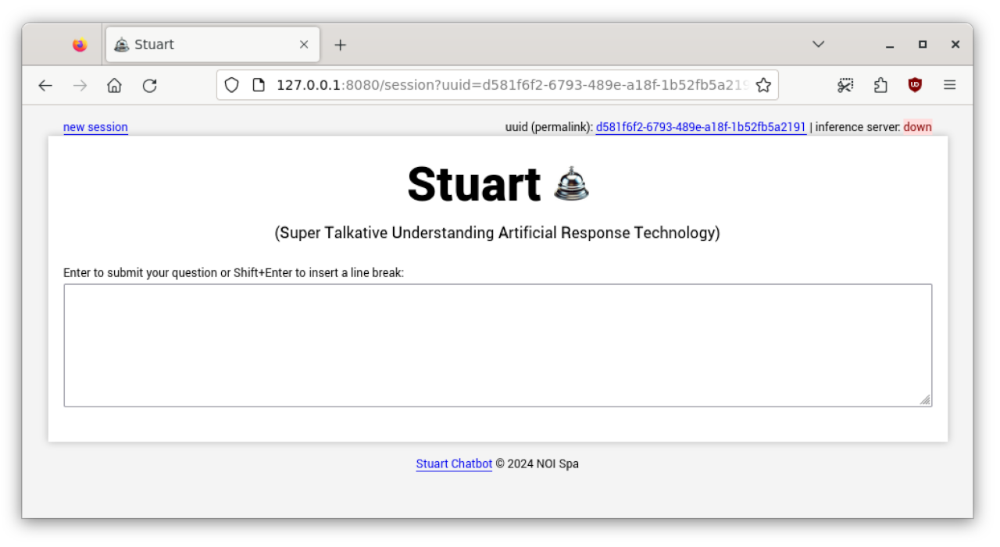

[](https://github.com/noi-techpark/opendatahub-docs/wiki/REUSE#badges)

# Stuart 🛎

(**S**uper **T**alkative **U**nderstanding **A**rtificial **R**esponse **T**echnology)

<!-- TOC -->
* [Stuart 🛎](#stuart-)
  * [Background](#background)
  * [Installation](#installation)
    * [Stuart](#stuart)
    * [Required service: Postgres with the pgvector extension](#required-service-postgres-with-the-pgvector-extension)
    * [Required service: LLM running behind a OpenAI-compatible chat-completion endpoint](#required-service-llm-running-behind-a-openai-compatible-chat-completion-endpoint)
      * [Which LLM to use?](#which-llm-to-use)
      * [How to run the LLM?](#how-to-run-the-llm)
  * [Running](#running)
    * [Preparing and RAGging the documents](#preparing-and-ragging-the-documents)
    * [Running the chatbot on the command line](#running-the-chatbot-on-the-command-line)
  * [Optional: Document Scrapers](#optional-document-scrapers)
  * [Optional: Converting documents to markdown (TODO)](#optional-converting-documents-to-markdown-todo)
  * [Optional: Running the chatbot as a web application](#optional-running-the-chatbot-as-a-web-application)
<!-- TOC -->


**Changelog of this document**

- 2026-02-01 updated for the major revision
- 2024-07-07 expanded to include information about the new web frontend and add a few recommendations for custom deployments
- 2024-03-27 added note about llama-cpp-python compile options
- 2024-03-25 first release - Chris Mair <chris@1006.org>

---


---

## Background

Stuart uses **RAG** (_retrieval-augmented generation_). RAG improves the quality of responses by
combining the capabilities of two main components: a retrieval system and a generative model.

The **retrieval system** searches a database of the user's documents to find information
that is relevant to the user's question. This step is crucial as it allows the generative model
to access knowledge that is not contained in its pre-trained parameters.

The **generative model** receives a prompt that is constructed from the retrieved 
information and the user's input. It then generates a coherent, natural text based on that prompt.

Stuart is a proof-of-concept system built with a few guiding principles:

- the system should run be able to run locally,
- it should only rely on Free models,
- it should be able to run on modest hardware (expensive datacenter GPUs are supported for fast performance, but not required),
- it should be easily expandable for users that wish to deploy a RAG system using their own documents.

When Stuart was first implemented at the beginning of 2024, there were already a few well known
Python packages to build RAG systems such as [LlamaIndex](https://docs.llamaindex.ai/en/stable/) and
[LangChain](https://www.langchain.com/). These packages were basically glue code
that abstracts away details about the underlying models and software components.

An early prototype of Stuart used LlamaIndex. However, LlamaIndex was and still is in very quick
evolution, are somewhat black-boxy and the integration between their components and the
documentation is sometimes lagging their quick progress.

To better understand the underlying technology and to keep things stable and simple,
we opted to not rely on any of these frameworks and rather implement a few functions,
such as text chunking and database access from scratch. It turned out that the
resulting code was not much longer, but easier to understand and using way fewer 
dependencies.

This makes Stuart **ideal as a testbed for experimenting with all the components
of a RAG system.**

Early 2026 Stuart was updated to be even more flexible and easier to use.

At **NOI Techpark**, Stuart is installed with access to documentation related to the **Open Data Hub**.
There are custom scrapers for the Github issues, the repository readme files, the past help desk
tickets and the wiki.

## Installation

### Stuart

To install Stuart your computer should have Python3 installed (with the ability to create virtual environments)
as well as have `git` available. Any Linux system should do, as well as macOS with the developer tools installed.

Expect install size for this part to be about 15 GiB.

You can check these dependencies with these commands:

```shell
python3 --version                                   # should give some version >= 3.9
echo "import venv, ensurepip" | python3; echo $?    # should give `0`
git --version                                       # should give some version >= 2.18
```

If the second command fails on Debian/Ubuntu, run a `sudo apt install python3-venv` to get the required Python modules.

If everything is good, fetch Stuart from its Github page and create a virtual environment for it:

```shell
cd ~
git clone https://github.com/noi-techpark/stuart-chatbot
python3 -m venv ~/stuart-chatbot/.venv
```

Remember to activate this virtual environment, whenever you work in it:

```shell
source ~/stuart-chatbot/.venv/bin/activate
```

The core functionality of Stuart is under the `rag/` directory. Change to that directory and install the requirements
into the virtual environment:

```shell
source ~/stuart-chatbot/.venv/bin/activate
cd ~/stuart-chatbot/rag
pip install -r requirements.txt
```

> A note about install size.
> 
> While there are just three dependencies, one dependency (the package `sentence-transformers`) is unfortunately huge.
> After installing that one, the virtual environment directory will be 7.3 GiB in size. After running it the first time,
> 2.2 GiB will be added (model download). Additionally, pip will cache another 4 GiB of files.

### Required service: Postgres with the pgvector extension

Stuart needs access to a [Postgres](https://www.postgresql.org/) database server with
the [pgvector](https://github.com/pgvector/pgvector) extension.

This can be any installation, local or managed. 

For a quick experiment, the most simple way to set this up is running the pgvector project's docker container:

```shell
docker run --restart unless-stopped --name mypg -e POSTGRES_USER=rag -e POSTGRES_PASSWORD=rag -e POSTGRES_DB=ragdb  -p 127.0.0.1:5432:5432 -d pgvector/pgvector:pg18-trixie
```

You might want to give it a stronger password, though.

Once the container is up, connect to the newly created instance:

```shell
docker exec -it mypg /usr/bin/psql -U rag ragdb
```

This will give you access to a Postgres shell. There, enable the pgvector extension and create the table
Stuart will use:

```sql
create extension vector;

create table ragdata (
    id          bigserial,
    tag         text not null,
    file_name   text not null,
    start_pos   bigint,
    end_pos     bigint,
    ts timestamp with time zone default now() not null,
    file_body   text not null,
    embedding   vector(1024) not null,
    primary key(id),
    unique(tag, file_name, start_pos, end_pos)
);
```

At the end leave the Postgres shell with `\q`.

For a production installation, we recommend performing a native installation of Postgres using the best practices
depending on your environment.

If you're using a different Postgres service (or use a stronger password), update the information under
`~/stuart-chatbot/rag/secrets_pg.json` accordingly, so Stuart will be able to connect to your Postgres service.

As long as you're handling less than, say, 100 MB of text, don't worry about performance. Search times won't matter much.
Once you feel search time increases, you can create an index on the vector column. Connect again to Postgres and just run
this once (it will be updated automatically from here on):

```sql
CREATE INDEX ragdata_embedding_hnsw_ix ON ragdata
USING hnsw (embedding vector_cosine_ops);
```

### Required service: LLM running behind a OpenAI-compatible chat-completion endpoint

Stuart needs access to a large language model (LLM). All you need is provide Stuart with a so called OpenAI-compatible chat-completion
endpoint. That's a fancy word to describe a LLM running behind a de-facto standard web service.

There are two sub-task here: which LLM should I use and how do I run it (as a suitable web service)?

#### Which LLM to use?

When LLMs first become popular and useful during 2023, they had an aura of being only available as a service through big,
proprietary vendors. During 2024 and 2025 there was a very fast-paced development in this space. Many vendors came up with
newer, smarter, faster models. Open weight models that you can freely download and run locally under FOSS licenses appeared,
and we now have open weight models that beat the original state-of-the-art models from the time Stuart was first released.

At the same time the software to run the models improved, allowing faster inference on machines without a GPU or with less VRAM or RAM.

RAG doesn't even need state-of-the-art models anymore. Basically all models are smart enough now for RAG. According to
our experiments, the quality of the search and the fact newer model can be fed larger context improve the performance
more than even smarter models.

Here are a few open weight LLMs, that are small enough to run on reasonably sized machines we recommend as of Feb 2026.

| LLM               | parameters  | Author                    | License  | recommended VRAM |
|-------------------|-------------|---------------------------|----------|------------------|
| Qwen3-30B-A3B     | 30.5b (MOE) | Alibaba (China)           | Apache 2 | 48 GiB           |
| Mistral Small 3.2 | 24b (dense) | MistralAI (Europe/France) | Apache 2 | 32 GiB           |
| gpt-oss-20b       | 21b (MOE)   | OpenAI (USA)              | Apache 2 | 16 GiB           |

The given amount of VRAM in this table is somewhat generous, as we expect the LLM is running locally on
the same machine where Stuart is also running. So, besides the LLM, also the embedding model need to fit into VRAM.

We also assume to have model versions with good quality (i.e. 8 bits per parameter or 4 bits for gpt-oss-20b).

For systems without a GPU expect slower performance. In that case it is probably advisable to use
gpt-oss-20b. On a headless Linux machine 16 GB of system RAM is enough to run gpt-oss-20b, but gets
tight when all the other parts of Stuart also need to run on the same system.


#### How to run the LLM?

Earlier versions of Stuart linked to a library to run the LLM inside Stuart. This is not very flexible.

Nowadays most deployments use an external software to run the LLM that exposes the model as a web service:
the so called OpenAI-compatible chat-completion endpoint. This has become a de facto standard.

You can use any of the popular local software packages to run the LLM!

In the NOI Techpark installation we use [llama.cpp](https://github.com/ggml-org/llama.cpp).

You can also use third-party service providers that offer open-weight models as a service. A popular
provider is [OpenRouter](https://openrouter.ai/). If you're looking for an EU-based provider, check out
[Scaleway's Generative APIs service](https://www.scaleway.com/en/generative-apis/).

For a quick experiment, one of the easiest ways to run open weight models locally is [downloading and running
Ollama](https://ollama.com/download).

Once you set that up, you can pull models from Ollama's model repository. The following table lists
the names of the models in that repository with our recommended quantization (bits per parameter): 

| LLM               | parameters/quantization | name in Ollama repo                     | download size      | recommended VRAM |
|-------------------|-------------------------|-----------------------------------------|--------------------|------------------|
| Qwen3-30B-A3B     | 30.5b (MOE) / 8 bits    | qwen3:30b-a3b-instruct-2507-q8_0        | 32 GiB             | 48 GiB           |
| Mistral Small 3.2 | 24b (dense) / 8 bits    | mistral-small3.2:24b-instruct-2506-q8_0 | 26 GiB             | 32 GiB           |
| gpt-oss-20b       | 21b (MOE) / 4 bits      | gpt-oss:20b                             | 14 GiB             | 16 GiB           |

To pull a model, run `ollama pull` with the model name:

```bash
ollama pull gpt-oss:20b
```

Whatever model provider you choose, remember to update the file `~/stuart-chatbot/rag/secrets_llm_endpoint.json`.

For a locally running Ollama serving gpt-oss-20b, the contents are:

```json
{
  "endpoint": "http://127.0.0.1:11434/v1/chat/completions",
  "model": "gpt-oss:20b",
  "api_key": ""
}
```

The `api_key` is only needed when a third party service provider is used.

## Running

### Preparing and RAGging the documents

Before you can use Stuart to ask questions about your documents, you need to make them available
as text or Markdown files and save them into one or more directories.

To get you started, there is a directory (`~/stuart-chatbot/data_example`) with 5 suitable files.
In follow-up sections we will explain how to scrape documents from other sources and/or convert documents from other formats.

Let's proceed to load the documents in the example directory to be used for RAG.
To "RAG" the documents means:

- read all the files from the given directory
- chunk them into overlapping chunks of roughly equal size
- call a sentence embedding model (see [Wikipedia](https://en.wikipedia.org/wiki/Sentence_embedding))
  to encode meaningful semantic information from each chunk into a point in a high-dimensional vector space
- store the file name, chunk and vector into Postgres.

That's the job of `~/stuart-chatbot/rag/load.py`.

That script contains a line to load the files:

```python
rag_dir("../data_example", tag="example", chunk_len=5000, overlap_len=500, hard_limit=6000)
```
Feel free to edit the script to add more paths. The parameters indicate the chunk lengths in number
of characters. Typical values might be in the order of 1000-10000 characters.

Run the script:

```shell
source ~/stuart-chatbot/.venv/bin/activate
cd ~/stuart-chatbot/rag
python load.py
```

When it runs for the first time, the script will automatically
download the sentence embedding model (2.2 GiB) and put it into `~/.cache`.

The model we use is [bge-m3](https://huggingface.co/BAAI/bge-m3) (license: MIT).
We pinned the version to 5a212480c9a75bb651bcb894978ed409e4c47b82 (2024-03-21). 

The model is quite large (2.2 GiB) for sentence embedding models, but performs very well,
can embed a variety of text sizes from short sentences to longer documents (8192 tokens ~ 20k characters) and
has been trained on many languages.

Expected output is:

```text
5/5 new files, 5 new chunks, chunked in 0.000s, embedded in 0.481s, stored in 0.253s
```

The run time very much depends on the capabilities of your hardware and the size
of the document. On a system with a single CPU core and no GPU, sentence embedding the
documents for the Open Data Hub (~ 20 million characters) might **take a few hours**.
Luckily, `load.py` **works incrementally**, so that is typically not a problem.

Note that `load.py` never deletes or updates document chunks in the database, it just adds chunks from new files.

If you want to delete chunks from the database you need to do that using SQL. Again connect
to Postgre and run a delete query. Here are some examples:

```SQL
delete from ragdata where tag = 'example'; -- delete chunks with a given tag (files from the same directory have the same tag)
delete from ragdata where tag = 'example' and file_name = 'eli-the-elephant.txt'; -- delete chunks from a given file
truncate ragdata; -- delete everything (!)
```

### Running the chatbot on the command line

Run the chatbot:

```text
source ~/stuart-chatbot/.venv/bin/activate
cd ~/stuart-chatbot/rag
python query.py
```

This will get you into an easy to use endless loop with the chatbot. Here is a sample
session!

```text
$ python query.py 
Stuart: You rang 🛎️ ?
Ask me anything or enter 'q' to exit. Enter 'r' to restart our conversation.
> What does gulp do?
{meta}
{meta} embedding vector search - top 5 chunks:
{meta} distance   tag  offset  file_name
{meta} --------   ---  ------  ---------
{meta} 0.36183 example       0  readme-about-imaginary-project.md <-- will be added to context
{meta} 0.62200 example       0  planets.txt
{meta} 0.67645 example       0  the-colony-on-xyris-9.txt
{meta} 0.68689 example       0  a-detective-story.md
{meta} 0.69902 example       0  eli-the-elephant.txt
{meta} please wait...
{meta} LLM output in  2.406s
{meta}
Gulp is a lightweight container orchestration engine that helps developers and DevOps teams deploy, manage, and scale containerized applications across cloud, bare‑metal, or edge environments. It provides dynamic scheduling, multi‑tenant isolation, auto‑scaling, immutable deployments, and built‑in observability to run container workloads efficiently and reliably.
> How do I install it?      
{meta}
{meta} embedding vector search - top 5 chunks:
{meta} distance   tag  offset  file_name
{meta} --------   ---  ------  ---------
{meta} 0.15713 example       0  readme-about-imaginary-project.md <-- will be added to context
{meta} 0.60331 example       0  planets.txt
{meta} 0.61157 example       0  the-colony-on-xyris-9.txt
{meta} 0.69188 example       0  a-detective-story.md
{meta} 0.70163 example       0  eli-the-elephant.txt
{meta} please wait...
{meta} LLM output in  1.862s
{meta}
**From source**

'''bash
git clone https://github.com/gulp/gulp.git
cd gulp
make build
'''

**With Docker**

'''bash
docker pull ghcr.io/gulp/gulp:latest
'''

After building or pulling, you can initialize a cluster with:

'''bash
gulp init --nodes 3
'''
```

Let's break down the parts

1. The user asks "What does gulp do?"

2. This piece of text is embedded and transformed into a vector. A query is run to find
   the closest vector stored in PostgreSQL and the top-5 matches are shown (lines starting 
   with `{meta}` are debug output). The best match is actually the right document: it's
   the file `data_example/readme-about-imaginary-project.md` about an imaginary software tool
   called _gulp_.

3. The code proceeds to build a prompt using the original question and the chunk from
   the document and inputs into the LLM.

4. The LLM answers correctly, based on our (nonsense) document.

5. The user asks a follow-up question "How do I install it?"

6. Now the LLMs answer plus the new question is again embedded and searched for (leading
   to the same document found as best match).

7. A new prompt is built using the follow-up question and the same chunk and input again to the LLM.

8. The LLMs answers with the correct information.

> It is important to point out, that LLMs - as is well known - tend to hallucinate. So any
> information should be double-checked!


Pause a moment to think about how powerful this semantic search is! We use a multi-language
embedding model, so language doesn't matter anymore. The search will find texts that are
close to the _meaning_ of the question, regardless the language.

Here is the result of a search that finds an English text from a German question:

``` text
> Wie heisst der Elefant?
{meta}
{meta} embedding vector search - top 5 chunks:
{meta} distance   tag  offset  file_name
{meta} --------   ---  ------  ---------
{meta} 0.40835 example       0  eli-the-elephant.txt <-- will be added to context
{meta} 0.56760 example       0  a-detective-story.md
{meta} 0.66857 example       0  the-colony-on-xyris-9.txt
{meta} 0.68387 example       0  planets.txt
{meta} 0.71171 example       0  readme-about-imaginary-project.md
```

The chat then proceeds:

```
> Wie heisst der Elefant?
Der Elefant heißt Eli.

> Wem half er?
Er half einer kleinen Füchsin.
```

This works perfectly well even though the LLMs sees the original English text in its prompt.
It has been instructed to answer in the language of the question and translates the information
in the text while answering.


## Optional: Document Scrapers

 (TODO: add info about Github issue scraper that was never documented)

Scraping means:

- download the documents,
- save them as plain text files.

For the Open Data Hub deployment, the document sources are:

- the readme markdown files from the relevant NOI Techpark repositories,
- the wiki markdown files from the ODH-Docs wiki,
- the tickets from the ODH Request Tracker installation.

For each category, there is a custom scraper in `scrapers/`.

Two scrapers are specially crafted for the Open Data Hub:

`scrape_readme.sh` scrapes the readme markdown files from the NOI Techpark repositories 
on GitHub that are relevant to the Open Data Hub. The links are read from a hand-crafted 
file (`scrape_readme_urls.txt`).

`scrape_wiki.sh` scrapes the wiki markdown files from the [ODH-Docs wiki](https://github.com/noi-techpark/odh-docs/wiki).

Additionally, there is a more generic scraper to scrape tickets from a well
known ticketing system (Best Practice' Request Tracker): `scrape_rt.py`.
It scrapes transactions of type 'Ticket created', 'Correspondence added'
or 'Comments added'. Remember to set up the location and credentials of the
Request Tracker installation in `scrape_rt.json`! 

The documents are stored in the `~/stuart-chatbot/data_*` directories.

Currently, scraping the readmes and the wiki just takes a few seconds, but 
**scraping the tickets takes a few hours**. Luckily `scrape_rt.py` works
incrementally, but it still needs about 20 minutes to check each ticket for
new transactions.

> The easiest way to run all these scripts is to set up a cronjob that runs
> `cron/cron-scrape.sh` that will take care of everything.

Stuart is designed to be easily extendable. You can **add scrapers for your own
documents**. The only requirement is the scrapers output **plain text files** (of any
dimension).

Again, there is a handy script that can be called from **crontab**: `cron/cron-load.sh`.


## Optional: Converting documents to markdown (TODO)

Show an example on how to convert a PDF to Markdown using MarkItDown.

## Optional: Running the chatbot as a web application

Stuart also comes with a web application and a system to queue and process
multiple conversations concurrently.

The files related to this part are under the directory `web/`.

Before running for the first time, edit `backend.json`:

```JSON
{
  "bind_ip": "127.0.0.1",
  "bind_port": "9001",
  "preshared_secret": "**********"
}
```

If you need to be able to connect via network instead of 127.0.0.1 (localhost), the value of `bind_ip`
should be changed to `0.0.0.0` (or any IP address you want).

**Please be aware that this opens up the web application to any users that may connect via
your configured network. There is no built-in authentication for users of the web interface.
Anybody who has access to the web application can open a session to input prompts and get
the answers.**

The value of `preshared_secret` is a secret string used by the inference backend to authenticate
itself against the web application to be allowed to process jobs. Put some hard to guess string
there.

To just run the application in the virtual Python environment already prepared for the
rest of Stuart:

```text
cd ~/stuart-chatbot
source .venv/bin/activate
cd web/
pip install -r requirements.txt  # note this adds Flask
python backend.py
```

Alternatively, you can run the application in a container with the provided Dockerfile.
The Docker host can be an independent server, there's no need to have the other Stuart components
installed. You don't need the Python environment or even Python at all on that host.

Remember to set the value of `bind_ip` in `web/backend.json` to `0.0.0.0` and proceed to build
the Docker image:

```text
cd ~/stuart-chatbot
cd web/
docker build -t stuart-web .
```

Then run the new image:

```text
docker run -p 127.0.0.1:8080:9001 stuart-web
```

Again, take care on where exactly you map the HTTP endpoint. With the `-p` parameter given
here, the application becomes visible on the host at `http://127.0.0.1:8080`. Change the value
according to what you need.

At this point the web application is ready. If you connect, a new session will be created,
and you can insert a question that will be queued:



However, nobody is yet processing the queue! So the question stays in the "question queued" state
indefinitely. We need to go back to the directory, where the command line application lives:

```text
cd ~/stuart-chatbot/
source .venv/bin/activate
cd rag/
```

In this directory, there is another `backend.json`. Edit it to point to the URL of the web application and set
the value of `preshared_secret` to the same string as above.

```JSON
{
  "endpoint": "http://127.0.0.1:9001",
  "preshared_secret": "**********"
}
```

Then start these two tasks:

```text
cd ~/stuart-chatbot/
source .venv/bin/activate
cd rag/
python backend_query.py
python backend_heartbeat.py
```

`backend_query.py` is the task that polls the web application and runs the jobs in the queue
in the same way as `query.py` did for the command line interface.

`backend_heartbeat.py` is not strictly necessary, it just updates a status field so the web
application is aware of the fact the queue is being processed (see the top left status
indicator of the web interface).

At this point the web interface is ready and will process your questions.

The session information (including all past questions and answers) is stored in a local
SQLite database (file stuart.db). It is recreated automatically at startup, if it is not present.

