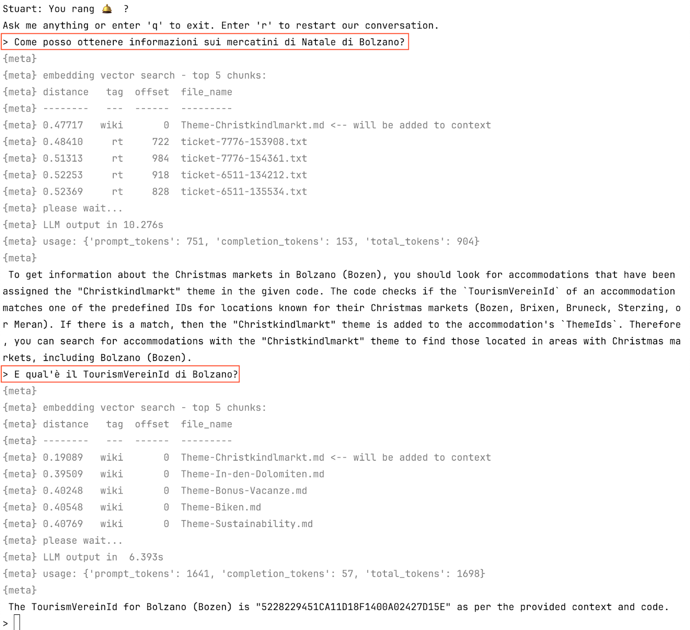

[](https://github.com/noi-techpark/opendatahub-docs/wiki/REUSE#badges)

# Stuart 🛎

(**S**uper **T**alkative **U**nderstanding **A**rtificial **R**esponse **T**echnology)

<!-- TOC -->
- [Stuart 🛎](#stuart-)
  - [Background](#background)
  - [Installation](#installation)
    - [Stuart](#stuart)
    - [PostgreSQL](#postgresql)
  - [Preparing the Data](#preparing-the-data)
    - [Scraping the Documents](#scraping-the-documents)
    - [RAGging  the Documents](#ragging--the-documents)
  - [Running the Chatbot on the command line](#running-the-chatbot-on-the-command-line)
  - [Running the Chatbot as a web application](#running-the-chatbot-as-a-web-application)
  - [A Note about the Models used](#a-note-about-the-models-used)
  - [A Note about Performance](#a-note-about-performance)
<!-- TOC -->

**Changelog of this document**

- 2024-07-07 expanded to include information about the new web frontend and add a few recommendations for custom deployments
- 2024-03-27 added note about llama-cpp-python compile options
- 2024-03-25 first release - Chris Mair <chris@1006.org>

---


---

## Background

Stuart uses **RAG** (_retrieval-augmented generation_). RAG improves the quality of responses by
combining the capabilities of two main components: a retrieval system and a generative model.

The **retrieval system** searches a database of documents, specifically the Open Data Hub wiki,
the past tickets history and the readme files of all related repositories to find information
that is relevant to the user's question. This step is crucial as it allows the generative model
to access knowledge  that is not contained in its pre-trained parameters.

The **generative model** receives a prompt that is constructed from the retrieved 
information and the user's input.  It then generates a coherent, natural text based on that prompt.

Stuart is a proof-of-concept system built with a few guiding principles:

- the system should run locally (no proprietary APIs),
- it should only rely on Free models,
- it should be able to run on modest hardware (expensive datacenter GPUs are supported for fast performance, but not required),
- it should be easily expandable for users that wish to deploy a RAG system using their own documents.

Currently, there are a few well known Python packages to build RAG
systems such as [LlamaIndex](https://docs.llamaindex.ai/en/stable/) and
[LangChain](https://www.langchain.com/). These packages are basically glue code
that abstracts away details about the underlying models and software components.
An early prototype of Stuart used LlamaIndex. However, these systems appear to
be in very quick evolution, are somewhat black-boxy and the integration between
their components and the documentation is sometimes lagging their quick progress.

To better understand the underlying technology and to keep things stable and simple,
we opted to not rely on any of these frameworks and rather implement a few functions,
such as text chunking and database access from scratch. It turned out that the
resulting code was not much longer, but easier to understand with way less 
dependencies.

This makes Stuart **ideal as a testbed for experimenting with all the components
of a RAG system.**

## Installation

Stuart is best run on a *nix OS.

The installation has been tested on macOS 13 with the command line developer
tools and on Linux (Debian 12 and Ubuntu 22.04) with the developer tools (packages 
`build-essential`, `git` and `python3-venv` must be installed).

The developer tools are required in case not all Python libraries
(`llama-cpp-python`, specifically) do provide binary releases for your
platform and need to be compiled from source.

You need **about 16 GiB of free space** for the model files and Python libraries,
so make sure there is enough space.
Additionally, some space for the PostgreSQL database (for the installation at
NOI that's less than 200 MiB).

### Stuart

Stuart needs a Python 3 environment with venv. The third-party Python libraries
are listed in `requirements.txt`:

```text
llama-cpp-python==0.2.56
psycopg2-binary==2.9.9
sentence-transformers==2.6.0
requests==2.31.0
```

That being said, installation is as simple as running the following commands as a normal
user:

```text
cd ~
git clone https://github.com/noi-techpark/stuart-chatbot
cd ~/stuart-chatbot
python3 -m venv .venv
source .venv/bin/activate
pip install -r requirements.txt 
```

That's it!

Almost. We also need to install the LLM itself (more below). Download
the model file into the home directory (4.8 GiB):

```text
cd ~
curl -LO https://huggingface.co/TheBloke/Mistral-7B-Instruct-v0.2-GGUF/resolve/main/mistral-7b-instruct-v0.2.Q5_K_M.gguf
```

### PostgreSQL

Stuart needs a [PostgreSQL](https://www.postgresql.org/) database server with
the [pgvector](https://github.com/pgvector/pgvector) extension.

This can be basically any installation, local or managed. 

To install PostgreSQL locally, just follow the steps listed on the
[official download page](https://www.postgresql.org/download/). Once the
server is up, define a role and a database and activate pgvector:

```text
su - postgres
psql

postgres=# create role rag login password '********';
 CREATE ROLE
postgres=# create database ragdb owner rag;
 CREATE DATABASE
postgres=# \c ragdb
 You are now connected to database "ragdb" as user "postgres".
ragdb=# create extension vector;
 CREATE EXTENSION
postgres=# \q
```

Once the database is up, load the table definition (here I assume PostgreSQL is running on 127.0.0.1):

```text
cd ~/stuart-chatbot/
psql -h 127.0.0.1 -U rag ragdb < rag/schema.sql
```

and edit the file with the credentials:

```text
cd ~/stuart-chatbot/
vim rag/secrets_pg.json
```

Ready!

## Preparing the Data

### Scraping the Documents

Before the chatbot can be used for the first time, we need to **scrape the documents**.

Scraping means:

- download the documents,
- save them as plain text files.

For the Open Data Hub deployment, the document sources are:

- the readme markdown files from the relevant NOI Techpark repositories,
- the wiki markdown files from the ODH-Docs wiki,
- the tickets from the ODH Request Tracker installation.

For each category, there is a custom scraper in `scrapers/`.

Two scrapers are specially crafted for the Open Data Hub:

`scrape_readme.sh` scrapes the readme markdown files from the NOI Techpark repositories 
on GitHub that are relevant to the Open Data Hub. The links are read from a hand-crafted 
file (`scrape_readme_urls.txt`).

`scrape_wiki.sh` scrapes the wiki markdown files from the [ODH-Docs wiki](https://github.com/noi-techpark/odh-docs/wiki).

Additionally, there is a more generic scraper to scrape tickets from a well
known ticketing system (Best Practice' Request Tracker): `scrape_rt.py`.
It scrapes transactions of type 'Ticket created', 'Correspondence added'
or 'Comments added'. Remember to set up the location and credentials of the
Request Tracker installation in `scrape_rt.json`! 

The documents are stored in the `~/stuart-chatbot/data_*` directories.

Currently, scraping the readmes and the wiki just takes a few seconds, but 
**scraping the tickets takes a few hours**. Luckily `scrape_rt.py` works
incrementally, but it still needs about 20 minutes to check each ticket for
new transactions.

> The easiest way to run all these scripts is to set up a cronjob that runs
> `cron/cron-scrape.sh` that will take care of everything.

Stuart is designed to be easily extendable. You can **add scrapers for your own
documents**. The only requirement is the scrapers output **plain text files** (of any
dimension).

### RAGging  the Documents

Once the documents are available in plain text format, we need to prepare the documents
for (_retrieval-augmented generation_).

This preparation ("RAGging") means:

- read all the files from the `~/stuart-chatbot/data_*` directories
- chunk them into overlapping chunks of roughly equal size
- call a sentence embedding model (see [Wikipedia](https://en.wikipedia.org/wiki/Sentence_embedding))
to encode meaningful semantic information from each chunk into a point in a
high-dimensional vector space
- store the file name, chunk and vector into PostgreSQL

That the job for `rag/load.py`.


`rag/load.py` runs the model using the `sentence-transformers` library that
is based on PyTorch. When it runs for the first time, this library will automatically
download the sentence embedding model (2.1 GiB) and put it into `~/.cache`.

The run time very much depends on the capabilities of your hardware and the size
of the document. On a system with a single CPU core and no GPU, sentence embedding the
documents for the Open Data Hub (~ 20 million characters) might **take a few hours**.
Luckily, `load.py` **works incrementally**, so that is typically not a problem.

Note that `load.py` never deletes or updates documents from the database,
it just adds new ones. For ticket transactions this is fine. However,
wiki pages and readme change, so it is a good idea to delete these
from time to time, so they can be RAGged again. `load.py` adds a tag
to each loaded document according to its source directory. Here are
the relevant lines from `load.py`.

```text
rag_dir("../data_readme", tag="readme", chunk_len=2000, overlap_len=250, hard_limit=2500)
rag_dir("../data_wiki",   tag="wiki",   chunk_len=2000, overlap_len=250, hard_limit=2500)
rag_dir("../data_rt",     tag="rt",     chunk_len=1000, overlap_len=250, hard_limit=1500)
```

So, for example, if you want to clean up the readme and wiki files, just connect to Postgres:

```text
psql -h 127.0.0.1 -U rag ragdb
```

and run this query:

```SQL
delete from ragdata where tag in ('readme', 'wiki');`.
```


Again, there is a handy script that can be called from **crontab**: `cron/cron-load.sh`.

## Running the Chatbot on the command line

Run the chatbot with these commands:

```text
cd ~/stuart-chatbot/
source .venv/bin/activate
cd rag/
python query.py
```

This will get you into an easy to use endless loop with the chatbot. Here is a sample
session!

---



---

Let's break down the components.

1. The user asks "Come posso ottenere informazioni sui mercatini di Natale di Bolzano?".

2. This piece of text is embedded and transformed into a vector. A query is run to find
   the closest vector stored in PostgreSQL and the top-5 matches are shown (lines starting 
   with `{meta}` are debug output). The best match is actually the right document: it's
   a wiki page talking about the Christmas markets ([here](https://github.com/noi-techpark/odh-docs/wiki/Theme-Christkindlmarkt)).

> Pause a moment to think about how powerful semantic search is! We use a multi-language
> embedding model, so the question is close to the wiki document because both refer to
> the _meaning_ "Christmas markets" regardless the fact that the _text_ is completely
> different. It's not even the same language (!).

3. The code proceeds to build a prompt using the original question and the chunk from
   the wiki document and inputs into the LLM.

4. The LLM answers with a (presumably) correct text.

5. The user asks a follow up question "E qual'è il TourismVereinId di Bolzano?"

6. Now the LLMs answer plus the new question is again embedded and searched for (leading
   to the same document found as best match).

7. A new prompt is built using the follow-up question and the same chunk and input again to the LLM.

8. The LLMs answers with the information. "5228229451CA11D18F1400A02427D15E" is indeed correct.

> It is important to point out, that LLMs - as is well known - tend to hallucinate. So any
> information should be double-checked!

## Running the Chatbot as a web application

Stuart also comes with a web application and a system to queue and process
multiple conversations concurrently.

The files related to this part are under the directory `web/`.

Before running for the first time, edit `backend.json`:

```JSON
{
  "bind_ip": "127.0.0.1",
  "bind_port": "9001",
  "preshared_secret": "**********"
}
```

If you need to be able to connect via network instead of 127.0.0.1 (localhost), the value of `bind_ip`
should be changed to `0.0.0.0` (or any IP address you want).

**Please be aware that this opens up the web application to any users that may connect via
your configured network. There is no built-in authentication for users of the web interface.
Anybody who has access to the web application can open a session to input prompts and get
the answers.**

The value of `preshared_secret` is a secret string used by the inference backend to authenticate
itself against the web application to be allowed to process jobs. Put some hard to guess string
there.

To just run the application in the virtual Python environment already prepared for the
rest of Stuart:

```text
cd ~/stuart-chatbot
source .venv/bin/activate
cd web/
pip install -r requirements.txt  # note this adds Flask
python backend.py
```

Alternatively, you can run the application in a container with the provided Dockerfile.
The Docker host can be an independent server, there's no need to have the other Stuart components
installed. You don't need the Python environment or even Python at all on that host.

Remember to set the value of `bind_ip` in `web/backend.json` to `0.0.0.0` and proceed to build
the Docker image:

```text
cd ~/stuart-chatbot
cd web/
docker build -t stuart-web .
```

Then run the new image:

```text
docker run -p 127.0.0.1:8080:9001 stuart-web
```

Again, take care on where exactly you map the HTTP endpoint. With the `-p` parameter given
here, the application becomes visible on the host at `http://127.0.0.1:8080`. Change the value
according to what you need.

At this point the web application is ready. If you connect, a new session will be created,
and you can insert a question that will be queued:


However, nobody is yet processing the queue! So the question stays in the "question queued" state
indefinitely. We need to go back to the directory, where the command line application lives:

```text
cd ~/stuart-chatbot/
source .venv/bin/activate
cd rag/
```

In this directory, there is another `backend.json`. Edit it to point to the URL of the web application and set
the value of `preshared_secret` to the same string as above.

```JSON
{
  "endpoint": "http://127.0.0.1:9001",
  "preshared_secret": "**********"
}
```

Then start these two tasks:

```text
cd ~/stuart-chatbot/
source .venv/bin/activate
cd rag/
python backend_query.py
python backend_heartbeat.py
```

`backend_query.py` is the task that polls the web application and runs the jobs in the queue
in the same way as `query.py` did for the command line interface.

`backend_heartbeat.py` is not strictly necessary, it just updates a status field so the web
application is aware of the fact the queue is being processed (see the top left status
indicator of the web interface).

At this point the web interface is ready and will process your questions.

The session information (including all past questions and answers) is stored in a local
SQLite database (file stuart.db). It is recreated automatically at startup, if it is not present.

## A Note about the Models used

The sentence embedding model is [bge-m3](https://huggingface.co/BAAI/bge-m3) (license: MIT).
We pinned the version to 5a212480c9a75bb651bcb894978ed409e4c47b82 (2024-03-21). 

The model is quite large (2.1 GiB) for sentence embedding models, but performs very well,
can embed a variety of text sizes from short sentences to longer documents (8192 tokens) and
has been trained on many languages.

The model is instantiated in `rag/librag.py`.

The LLM is [Mistral-7B-Instruct-v0.2](https://huggingface.co/mistralai/Mistral-7B-Instruct-v0.2) (license: Apache 2).
We use a version in GGUF format with parameters quantized to ~ 5 bits ([here](https://huggingface.co/TheBloke/Mistral-7B-Instruct-v0.2-GGUF))
and run the inference using [llama-cpp-python](https://github.com/abetlen/llama-cpp-python).

The model performs very well given it's relatively small size of 7E9 parameters (4.8 GiB in the quantized version).
Besides English, it understands also German and Italian, but doesn't speak them well.

From the same company, Mistral AI, a second model is available under the Apache 2 license:
[Mixtral-8x7B-Instruct-v0.1](https://huggingface.co/mistralai/Mixtral-8x7B-Instruct-v0.1). This
model is about 6 times larger, but only twice as slow.

Of course, other local models can be used as long as they are supported by
the `llama-cpp-python` library.

The model is instantiated in `rag/query.py` and `rag/backend_query.py`.

While changing model might be interesting, for example with regard
to supported languages, it has only a minor influence of the quality
of the overall responses.

Tests suggest the quality of RAG systems very much depends on the
**search** and the size of the document chunks, not so much the LLM.

As is common to all simple RAG systems, Stuart for example fails to answer
questions  that would need to pick up pieces of information scattered around
a large documentation base. Changing the LLM would not improve on this.


## A Note about Performance

Stuart requires at least 16 GB of RAM. 

A single CPU core is enough to run it, but answers take 1-5 minutes with a single core. More
cores improve the performance up to a point where LLM inference becomes memory-bandwidth-bound.

When scaling up che core count, for example using a cloud-based VM, check whether the additional
cores are not starved by insufficient memory bandwidth. This typically starts to happen between
4 and 16 cores, depending on per floating point performance and memory bandwidth.

When the `llama-cpp-python` package is installed, the underlying inference code (`llama-cpp`) is compiled
for the effective hardware using a number of default settings. One of those settings indicates
the maximum number of threads to use: the default is to use half the number of logical cores, so to match
the number of physical cores.

VMs in the cloud normally expose logical cores, but the underlying host might match all logical cores present
in the VM to physical cores on the host system. So the default of using a number of threads equal to only
half the number of logical cores leaves some performance on the table.

We've found that for VMs with a small number of logical cores ("vCPU"), such as 2, performance can be improved
by compiling `llama-cpp` to use the OpenBLAS backend which spawns as many threads as there are logical cores.

It's very easy to change an existing installation of Stuart to make use of this.
You need to install additional packages first (on Debian: `libopenblas-dev` and `pkg-config`) and force a
re-installation of `llama-cpp-python`:

```text
cd ~/stuart-chatbot/
source .venv/bin/activate
CMAKE_ARGS="-DLLAMA_BLAS=ON -DLLAMA_BLAS_VENDOR=OpenBLAS" pip install --force-reinstall --no-cache-dir llama-cpp-python==0.2.56
```

For VMs with larger numbers of logical cores, this is not true anymore as the host can't map as
many physical cores into the VM. In that case performance with the OpenBLAS backend might be worse.
You can get back to a default installation with:

```text
cd ~/stuart-chatbot/
source .venv/bin/activate
pip install --force-reinstall --no-cache-dir llama-cpp-python==0.2.56
```

You can explore even more backends (see [llama-cpp-python supported backends](https://github.com/abetlen/llama-cpp-python?tab=readme-ov-file#supported-backends)),
such as _cuBLAS_ (for Nvidia GPUs) or _Metal_ (for Mac GPUs). Typically, response times go down to a few to ten seconds when GPUs are used.

For example to compile for cuBLAS (for Nvidia GPUs):
```text
cd ~/stuart-chatbot/
source .venv/bin/activate
CMAKE_ARGS="-DLLAMA_CUBLAS=on" pip install --verbose --force-reinstall --no-cache-dir llama-cpp-python==0.2.56
```

